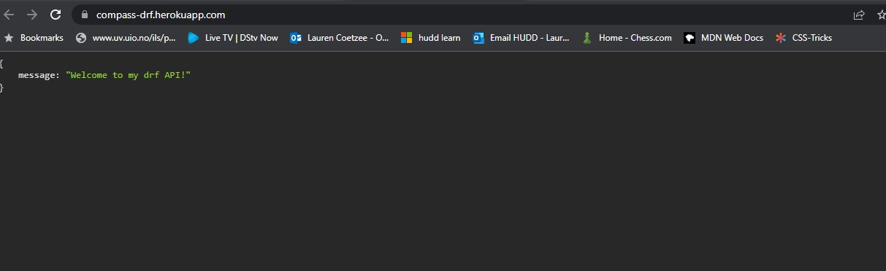
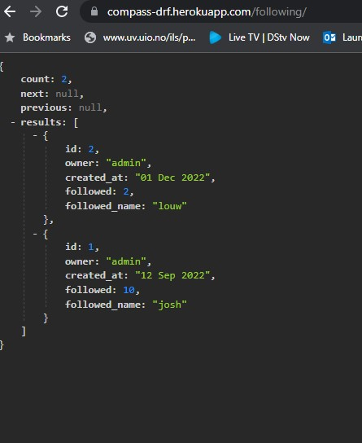
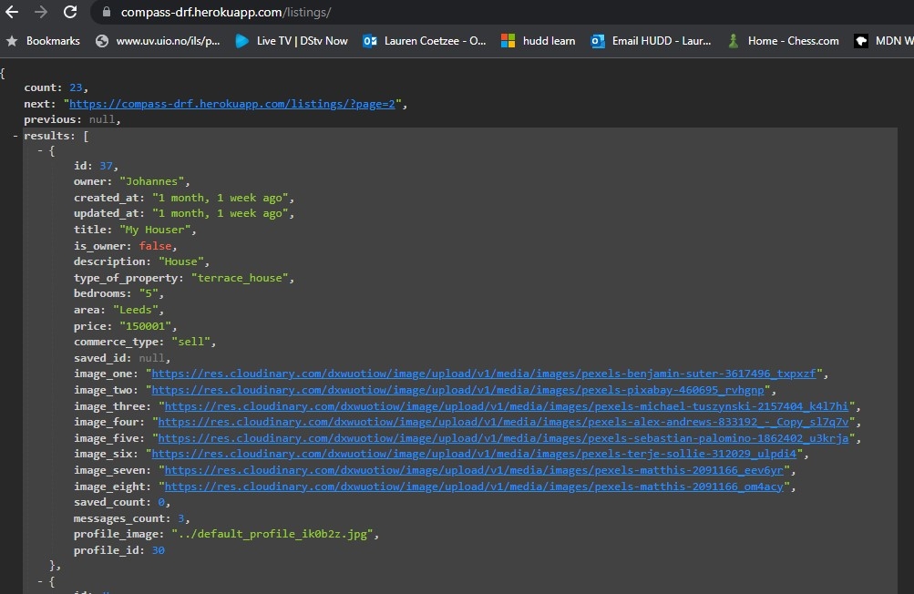
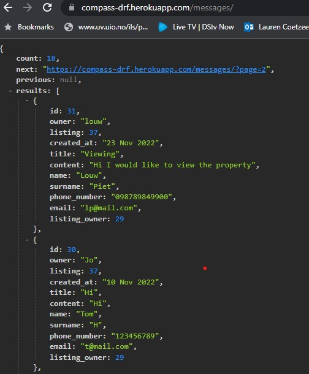
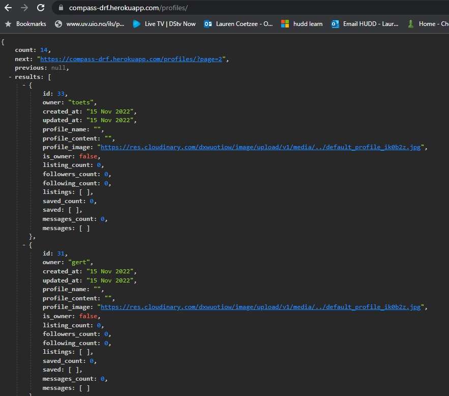
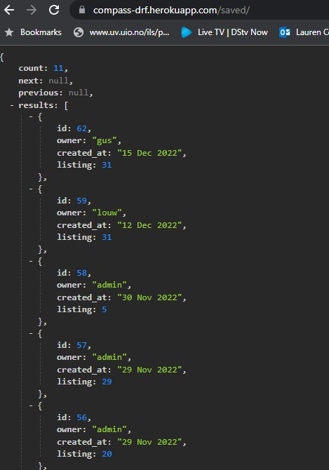
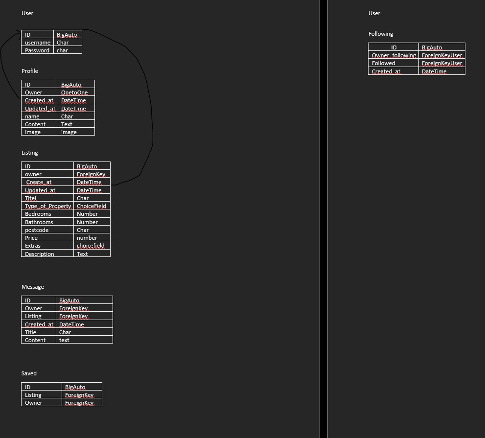
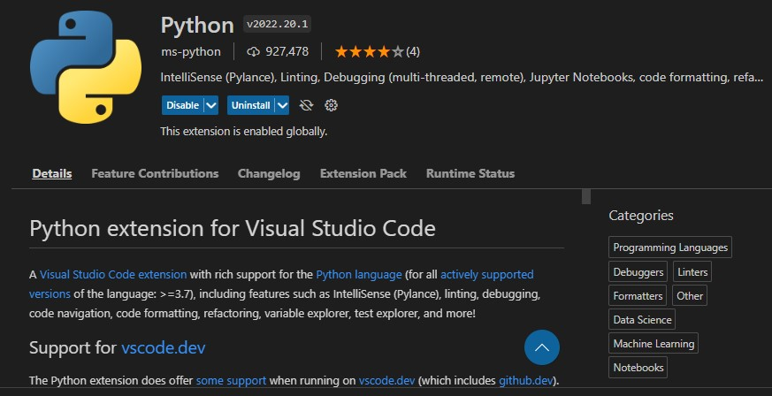

 <h1 align="center">Compass API</h1>

[View the live project here](https://compass-drf.herokuapp.com/)

Compass API is written to be used as a backend for a real estate type app. It uses the Django Rest Framework. The API has various app that can be used. It has a follow model that can be used for users following other user, a listing model where all the property listings can be saved, a messages model for sending messages to other users, a saved model for users to save their favorite listings and a profile model to update profile pictures or write something about the user. 

## Index – Table of Contents
* [User Experience (UX)](#user-experience-ux) 
* [Features](#features)
* [Design](#design)
* [Planning](#planning)
* [Technologies Used](#technologies-used)
* [Testing](#testing)
* [Deployment](#deployment)
* [Credits](#credits)

## User Experience (UX)

### User stories :

* US01: Register/Login
  - As a **Site User** I can **create a profile** so that **I can access the features of the site**
* US02: Post a listing
  - As a **Site User** I can **log in** so that **I can list a property for sale**
* US03: Follow a User
  - As a **Site User** I can **follow a other user** so that **I can see all his listings and stay up to date if he lists new properties**
* US04: Messages
  - As a **Site User** I can **send a message** so that **I can request more info on the property or request a viewing**
* US05: Save a Listing
  - As a **Site User** I can **save a listing** so that **I can keep all the listings I like**
* US06: Update Profile
  - As a **Site User** I can **update my profile** so that **I can change my photo or write something about myself**
* US07: Update Listing
  - As a **Site User** I can **update my listing** so that **change the price or the description or photo**
* US08: Delete a listing
  - As a **Site User** I can **delete my listings** so that **I can remove a listing if a property is sold**
* US09: Listing security
  - As a **Site User** I can **change only my own listings** so that **no one else can change my listings**
* US10: Delete saved Listing
  - As a **Site User** I can **delete a saved listing** so that **I can remove it from my list of saved items**
* US11: Unfollow a user
  - As a **Site user** I can **unfollow a user** so that **I can no loger follow a user**
* US12: Delete a message
  - As a **Site user** I can **delete a message** so that **the user I sent the message to can no longer see it**

## Features

### Existing Features

-   __F01 Landing page__
    The landing page is very basic and welcome the user to the page.

    
   

-   __F02 Follow page__
    
    The follow view show the following
    - ID 
    - Owner of the profile
    - Created at (when it was created)
    - Followed (the id of the user being followed)
    - Follwed name (the username of the user being followed)

    The following page can be accessed through https://compass-drf.herokuapp.com/following/.
    A message detail can be accessed by adding the id to the end expel. https://compass-drf.herokuapp.com/following/3.
    The owner of the profile will be able to delete the followed user.
    The information is paginated and only 12 posts is displayed per page

    

-   __F03 Listing page__
    
    The Listings page has a list of all the property listings. I has many features.
    - ID 
    - Owner (Listing owner)
    - create at (When created)
    - updated at (when updated)
    - Title (short description)
    - is_owner (checks if current user is owner)
    - description (description of item)
    - type_of_property (what type of property expel. detached house, apartment etc.)
    - bedrooms (number of bedrooms)
    - area (area of property)
    - price (price of property)
    - commerce_type (is the property for rent or for sale)
    - saved_id (id of user that saved property)
    - images (images of property nr 1 to 8)
    - saved_count (the amount of users that has saved the property)
    - messages count (the amount of messages sent to owner)
    - profile_image (the profile image of the owner)
    - profile_id (profile id of owner)
    The information is paginated and only 12 posts is displayed per page
    https://compass-drf.herokuapp.com/listings/ displays a list
    https://compass-drf.herokuapp.com/listings/2 displays a the listing with the id 2. 
    The owner is the only user that can update or delete the listing

    

-   __F04 Messages page__
    
    The messages has the following information
    - ID
    - owner (owner of the message)
    - listing (id of listing message is querying)
    - created_at (when message was created)
    - title (short title or heading)
    - content (content of message)
    - name (name of sender)
    - surname (surname of sender)
    - phone_number (number of sender)
    - email (email of sender)
    - listing_owner (id of listing owner)
    The information is paginated and only 12 posts is displayed per page
    https://compass-drf.herokuapp.com/messages/ displays list of messages
    https://compass-drf.herokuapp.com/messages/1 displays message with id 1.
    The owner is the only user that can update or delete the message.

    
    

-   __F05 Profile page__
    
    The Profile page has the following information
    - ID 
    - owner (owner of profile)
    - created_at (when profile was created)
    - updated_at ( when profile was updated)
    - profile_name
    - profile_content (something about user)
    - profile_image
    - is_owner (checks if current user is owner of profile)
    - listing_count (the amount of listings of the owner)
    - followers_count (users following owner)
    - following_count (owner following users)
    - listings (id of each listing of owner)
    - saved_count (number of listings saved) 
    - saved (id of each listing saved)
    - messages_count (the messages recieved)
    - messages (id of each message)
    The information is paginated and only 12 items is displayed per page
    https://compass-drf.herokuapp.com/profiles displays a list of profiles
    https://compass-drf.herokuapp.com/profiles/2 display profile with id 2.
    The owner is the only user that can update or delete the profile

    
    

-   __F06 Saved page__
    
    The Saved page has the following information
    - ID 
    - owner (user that saved listing)
    - created_at
    - listing (listing that is saved)
    The information is paginated and only 12 items is displayed per page
    https://compass-drf.herokuapp.com/saved displays a list of saved items
    https://compass-drf.herokuapp.com/saved/1 displays the saved item with id 1
    The owner is the only user that can delete the saved item

    
    

### Features which could be implemented in the future

-   __Social login__
    
    Add login by using social accounts

-   __Listing likes__
    
    Implement function for users to like listings

**Database Design**

- PostgreSQL was used for the database originally
- Database was migrated to ElephantSQL 

## Technologies Used

### Languages Used

-   [Python](https://www.python.org/)

### Frameworks, Libraries & Programs Used

-   [Django Rest Framework](https://www.django-rest-framework.org/) was used as the framework to support rapid and secure development of the application
-   [Git:](https://git-scm.com/) was used for version control by utilizing the Gitpod terminal to commit to Git and Push to GitHub.
-   [GitHub:](https://github.com/) is used as the repository for the project code after being pushed from Git. In addition, for this project GitHub was used for the agile development aspect through the use of User Stories (GitHub Issues) and tracking them on a Kanban board.
-   [Django](https://www.djangoproject.com/) was used as the framework to support rapid and secure development of the application
-   [Gunicorn](https://gunicorn.org/) was used as the Web Server to run Django on Heroku
-   [dj_database_url](https://pypi.org/project/dj-database-url/) library used to allow database urls to connect to the postgres db
-   [psycopg2](https://pypi.org/project/psycopg2/) database adapter used to support the connection to the postgres db
-   [Cloudinary](https://cloudinary.com/) used to store the images used by the application
-   [Django allauth](https://django-allauth.readthedocs.io/en/latest/index.html) used for account registration and authentication

## Testing
- Test were written for all apps
- in total 25 test was written and all passed
- Django Rest Frameworks API test case was used to test 

### Validator Testing 
- Python extension in Gitpod was used for formatting code and validating python code

### Known bugs

- Currently no known bugs.

## Deployment

### How to Clone the Repository 

- Go to the https://github.com/louwJohan/compass-drf repository on GitHub 
- Click the "Code" button to the right of the screen, click HTTPs and copy the link there
- Open a GitBash terminal and navigate to the directory where you want to locate the clone
- On the command line, type "git clone" then paste in the copied url and press the Enter key to begin the clone process
- To install the packages required by the application use the command : pip install -r requirements.txt
- When developing and running the application locally set DEBUG=True in the settings.py file
- Changes made to the local clone can be pushed back to the repository using the following commands :

  - git add *filenames*  (or "." to add all changed files)
  - git commit -m *"text message describing changes"*
  - git push

- N.B. Any changes pushed to the master branch will take effect on the live project once the application is re-deployed from Heroku

### Create Application and Postgres DB on Heroku
- Log in to Heroku at https://heroku.com - create an account if needed.
- From the Heroku dashboard, click the Create new app button.  For a new account an icon will be visible on screen to allow you to Create an app, otherwise a link to this function is located under the New dropdown menu at the top right of the screen.
- On the Create New App page, enter a unique name for the application and select region.  Then click Create app.
- On the Application Configuration page for the new app, click on the Resources tab.
- In the Add-ons search bar enter "Postgres" and select "Heroku Postgres" from the list - click the "Submit Order Form" button on the pop-up dialog.
- Next, click on Settings on the Application Configuration page and click on the "Reveal Config Vars" button - check the DATABASE_URL has been automatically set up. 
- Add a new Config Var called DISABLE_COLLECTSTATIC and assign it a value of 1.
- Add a new Config Var called SECRET_KEY and assign it a value - any random string of letters, digits and symbols.
- The settings.py file should be updated to use the DATABASE_URL and SECRET_KEY environment variable values as follows :

  - DATABASES = {'default': dj_database_url.parse(os.environ.get('DATABASE_URL'))}

  - SECRET_KEY = os.environ.get('SECRET_KEY')

- In Gitpod, in the project terminal window, to initialize the data model in the postgres database, run the command : python3 manage.py migrate 
- Make sure the project requirements.txt file is up to date with all necessary supporting files by entering the command : pip3 freeze --local > requirements.txt
- Commit and push any local changes to GitHub.
- In order to be able to run the application on localhost, add SECRECT_KEY and DATABASE_URL and their values to env.py

### Configure Cloudinary to host images used by the application
- Log in to Cloudinary - create an account if needed.  To create the account provide your name, email and set up a password.  For "primary interest" you can choose "Programmable Media for image and video API".  Click "Create Account" and you will be sent an email to verify your account and bring you to the dashboard.
- From the dashboard, copy the "API Environment variable" value by clicking on the "Copy to clipboard" link.
- Log in to Heroku and go to the Application Configuration page for the application.  Click on Settings and click on the "Reveal Config Vars" button.
- Add a new Config Var called CLOUDINARY_URL and assign it the value copied from the Cloudinary dashboard, but remove the "CLOUDINARY_URL=" at the beginning of the string. 
- In order to be able to run the application on localhost, also add the CLOUDINARY_URL environment variable and value to env.py

### Connect the Heroku app to the GitHub repository
- Go to the Application Configuration page for the application on Heroku and click on the Deploy tab.
- Select GitHub as the Deployment Method and if prompted, confirm that you want to connect to GitHub. Enter the name of the github repository (the one used for this project is (https://github.com/louwJohan/compass-drf) and click on Connect to link up the Heroku app to the GitHub repository code.
- Scroll down the page and choose to either Automatically Deploy each time changes are pushed to GitHub, or Manually deploy - for this project Manual Deploy was selected.
- The application can be run from the Application Configuration page by clicking on the Open App button.
- The live link for this project is (https://compass-drf.herokuapp.com/)

### Final Deployment steps
Once code changes have been completed and tested on localhost, the application can be prepared for Heroku deployment as follows :
- Set DEBUG flag to False in settings.py
- Ensure requirements.txt is up to date using the command : pip3 freeze --local > requirements.txt
- Push files to GitHub
- In the Heroku Config Vars for the application delete this environment variable :  DISABLE_COLLECTSTATIC
- On the Heroku dashboard go to the Deploy tab for the application and click on deploy branch

## Credits 
- Code was used from the Moments DRF code along
### Code 
-  Code examples was used from the Django rest framework tutorials 

